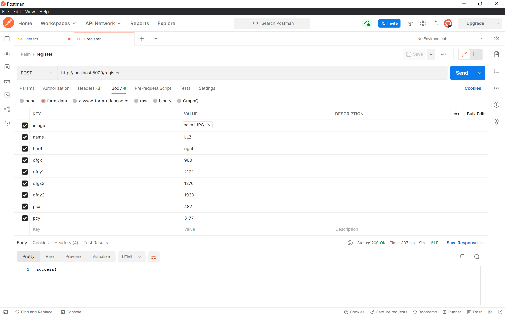
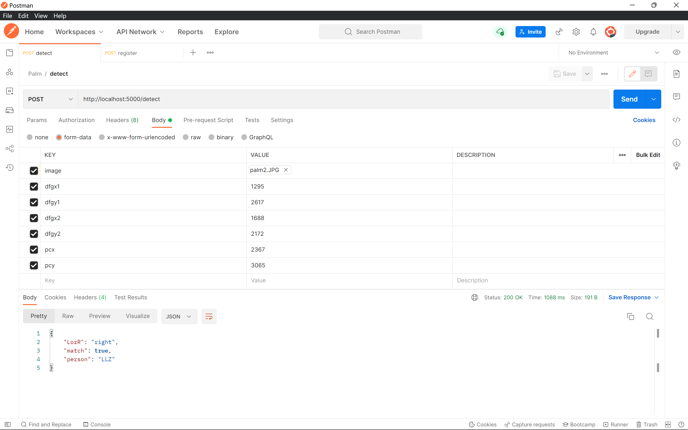

# Palm Detection Backend

## 运行

**依赖：**

- numpy
- pytorch
- albumentations
- flask
- opencv python

**运行：**

```shell
python main.py --port 端口,默认5000 --device 运行设备,默认cpu --resume 权重路径,默认weight.ckpt
```

## API说明

### 注册

用户注册手掌信息

**路径：**`/register`

**方法：**POST

**Body 数据类型：**Form Data

**参数列表：**

| Key   | Value Type               | Description                     |
| ----- | ------------------------ | ------------------------------- |
| image | File                     | 手掌图片文件                    |
| name  | Text                     | 注册者人名                      |
| LorR  | Text ("right" or "left") | 左右手                          |
| dfgx1 | Text                     | 第一个finger gap区域的中心x坐标 |
| dfgy1 | Text                     | 第一个finger gap区域的中心y坐标 |
| dfgx2 | Text                     | 第二个finger gap区域的中心x坐标 |
| dfgy2 | Text                     | 第二个finger gap区域的中心y坐标 |
| pcx   | Text                     | palm center区域的中心x坐标      |
| pcx   | Text                     | palm center区域的中心y坐标      |

*后端会将坐标从String类型转换为Number类型*

**返回值：**

类型：String

success!

### 检测

检测手掌图片

**路径：**`/detect`

**方法：**POST

**Body 数据类型：**Form Data

**参数列表：**

| Key   | Value Type | Description                     |
| ----- | ---------- | ------------------------------- |
| image | File       | 手掌图片文件                    |
| dfgx1 | Text       | 第一个finger gap区域的中心x坐标 |
| dfgy1 | Text       | 第一个finger gap区域的中心y坐标 |
| dfgx2 | Text       | 第二个finger gap区域的中心x坐标 |
| dfgy2 | Text       | 第二个finger gap区域的中心y坐标 |
| pcx   | Text       | palm center区域的中心x坐标      |
| pcx   | Text       | palm center区域的中心y坐标      |

**返回值：**

类型：JSON

```shell
{ 
	'match': Boolean,  # 是否匹配成功
	'person': String   # 匹配人姓名
	'LorR': String     # 左右手, right/left
}
```

## 示例

**注册**



**检测**


